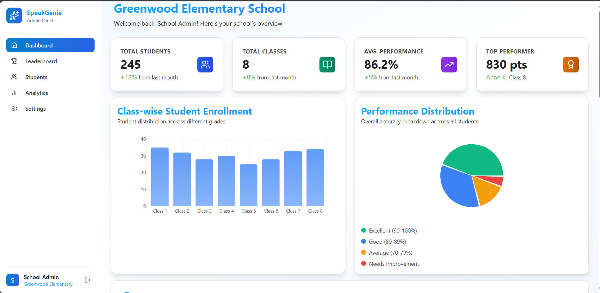
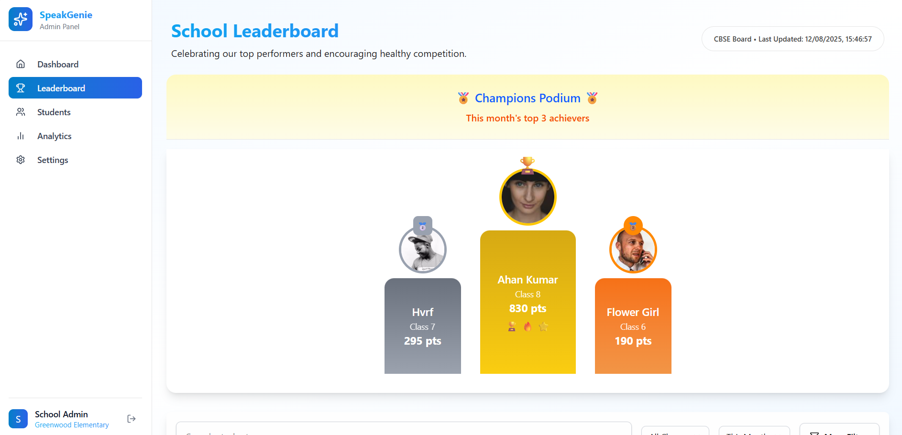
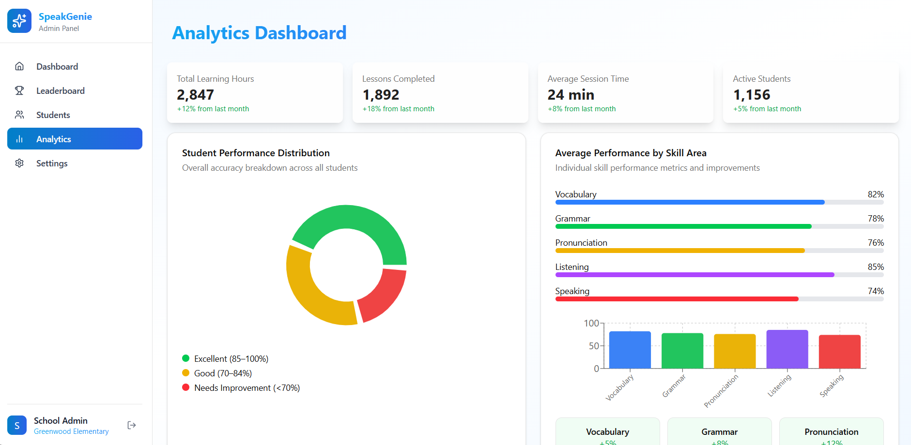
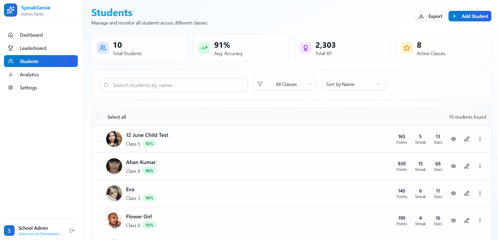

# 🏫 School Admin Panel - SpeakGenie

A modern, responsive school administration dashboard built with React and Tailwind CSS. This project features a complete admin interface for managing students, tracking performance, and analyzing educational data.

## 🌐 Live Demo

**Deployed at:** [Insert Deployment Link Here]

---

## 📸 Screenshots

### Dashboard Overview


### Leaderboard with Podium Design


### Analytics & Charts


### Students Management (Custom Addition)


---

## ✨ Features

### 🎯 **Core Pages (Pixel-Perfect Implementation)**
- **Dashboard** - Overview with key metrics, charts, and quick stats
- **Leaderboard** - Student rankings with podium design and performance tracking
- **Analytics** - Comprehensive charts showing student engagement and performance trends
- **Settings** - Configuration and customization options

### 🆕 **Additional Features**
- **Students Page** - Complete student management system (custom addition beyond original design)
  - Advanced search and filtering
  - Bulk operations (edit, delete)
  - Responsive expandable details
  - Performance tracking and statistics

### 🔄 **Interactive Components**
- **Working Search Bars** - Real-time filtering across all pages
- **Dynamic Filters** - Class selection, performance levels, sorting options
- **Responsive Charts** - Interactive data visualizations using Recharts
- **Mobile Navigation** - Hamburger menu with smooth animations
- **Expandable Cards** - Mobile-optimized detail views
- **Bulk Selection** - Checkbox functionality for multiple operations

---

## 🛠️ Tech Stack

### **Frontend Framework**
- **React 18** - Component-based UI library
- **JavaScript (ES6+)** - Modern JavaScript features
- **Vite** - Fast build tool and development server

### **Styling & UI**
- **Tailwind CSS** - Utility-first CSS framework
- **shadcn/ui** - High-quality component library
  - Button, Card, Sheet, Select, Separator, Tooltip, Checkbox
- **Lucide React** - Beautiful icon library
- **Custom CSS** - Additional styling for specific components

### **Data Visualization**
- **Recharts** - Composable charting library
  - Pie Charts, Bar Charts, Line Charts
  - Responsive containers and custom styling

### **State Management**
- **React Context API** - Centralized student data management
- **React Hooks** - useState, useMemo, custom hooks

### **Responsive Design**
- **Mobile-First Approach** - Optimized for all screen sizes
- **Breakpoint System** - sm, md, lg, xl responsive design
- **Flexbox & Grid** - Modern layout techniques

---

## 🎨 Design System

### **Color Palette**
- **Primary:** Dark Blue/Teal (#0D47A1)
- **Success:** Green (#4CAF50)
- **Warning:** Orange/Amber (#FFC107)
- **Info:** Light Blue (#2196F3)
- **Background:** Light Gray (#F5F5F5)
- **Surface:** White (#FFFFFF)

### **Typography**
- **Gradient Text** - Eye-catching headings
- **Responsive Font Sizes** - Optimized for different screen sizes
- **Consistent Spacing** - Uniform margins and padding

---

## 📱 Responsive Features

### **Desktop (lg+)**
- Full sidebar navigation
- Complete data tables with all columns
- Hover effects and tooltips
- Multi-column layouts

### **Tablet (md-lg)**
- Collapsible sidebar with Sheet component
- Condensed data views
- Touch-friendly interactions
- Optimized grid layouts

### **Mobile (sm)**
- Hamburger menu navigation
- Expandable detail cards
- Essential information prioritized
- Single-column layouts
- Touch-optimized buttons

---

## 🔧 Key Components

### **Layout System**
```jsx
// Responsive layout with mobile hamburger menu
<Layout>
  <Sidebar /> // Hidden on mobile, Sheet component for overlay
  <MainContent /> // Responsive content area
</Layout>
```

### **Student Context**
```jsx
// Centralized data management
const { students, getTopPerformers, getStats } = useStudentContext();
```

### **Interactive Charts**
```jsx
// Recharts integration with custom styling
<ResponsiveContainer>
  <PieChart data={performanceData} />
  <BarChart data={enrollmentData} />
</ResponsiveContainer>
```

---

## 📊 Page Breakdown

### 🏠 **Dashboard**
- **Overview Cards** - Total students, average performance, engagement metrics
- **Quick Stats** - Real-time data summaries
- **Chart Components** - Performance distribution and enrollment trends
- **Recent Activity** - Latest student activities and achievements

### 🏆 **Leaderboard**
- **Podium Design** - Top 3 students with elevated display
- **Ranking System** - Complete student rankings with points and streaks
- **Performance Badges** - Color-coded achievement levels
- **Filtering Options** - Sort by different metrics

### 📈 **Analytics**
- **Student Engagement** - Trend analysis over time
- **Performance Distribution** - Pie charts showing grade distributions
- **Class Comparison** - Bar charts comparing different classes
- **Skill Development** - Progress tracking across subjects

### 👥 **Students (Custom Page)**
- **Complete Student Directory** - Comprehensive student management
- **Advanced Search** - Real-time name-based filtering
- **Class Filtering** - Filter by specific classes
- **Bulk Operations** - Select multiple students for batch actions
- **Mobile Optimization** - Expandable details for small screens
- **Performance Tracking** - Individual student statistics

### ⚙️ **Settings**
- **Profile Configuration** - Admin profile management
- **System Preferences** - Customization options
- **Data Management** - Import/export functionality

---

## 🚀 Performance Optimizations

- **React.memo** - Preventing unnecessary re-renders
- **useMemo & useCallback** - Optimizing expensive calculations
- **Lazy Loading** - Code splitting for better initial load times
- **Responsive Images** - Optimized avatar loading
- **Efficient Filtering** - Debounced search and optimized algorithms

---

## 📋 Installation & Setup

```bash
# Clone the repository
git clone https://github.com/dhruv-kashyap-sde/Admin-Panel-GES.git

# Navigate to project directory
cd Frontend

# Install dependencies
npm install

# Start development server
npm run dev

# Build for production
npm run build

# Preview production build
npm run preview
```

---

## 🔄 Development Workflow

### **Component Structure**
```
src/
├── components/
│   ├── admin_panel/
│   │   ├── dashboard/
│   │   ├── leaderboard/
│   │   ├── students/
│   │   ├── analytics/
│   │   └── settings/
│   └── ui/ (shadcn components)
├── context/
│   └── StudentContext.jsx
└── lib/
    └── utils.js
```

### **Responsive Breakpoints**
- **sm:** 640px and up (Mobile landscape)
- **md:** 768px and up (Tablet)
- **lg:** 1024px and up (Desktop)
- **xl:** 1280px and up (Large desktop)

---

## 🎯 Project Highlights

### ✅ **Pixel-Perfect Implementation**
- Faithful recreation of provided design specifications
- Consistent spacing, colors, and typography
- Accurate component positioning and sizing

### ✅ **Enhanced Functionality**
- Added comprehensive Students page beyond original design
- Interactive components with real-time feedback
- Advanced filtering and search capabilities

### ✅ **Modern Development Practices**
- Component-based architecture
- Reusable UI components
- Clean code organization
- Responsive-first design approach

### ✅ **Production Ready**
- Optimized build process
- Cross-browser compatibility
- Mobile-optimized performance
- Accessible design patterns

---

## 🤝 Contributing

This project demonstrates modern React development practices and responsive design principles. The codebase is well-organized and documented for easy maintenance and extension.

---

## 📄 License

This project is part of a portfolio demonstration showcasing frontend development skills with React, Tailwind CSS, and modern UI libraries.

---

**Built with ❤️ using React, Tailwind CSS, and shadcn/ui**
